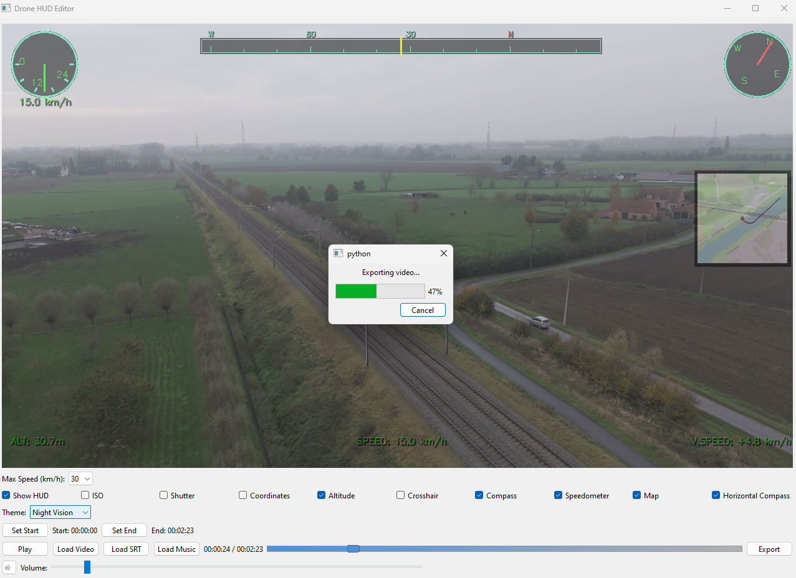

# Drone HUD Editor

A professional heads-up display (HUD) overlay editor for DJI drone videos, integrating telemetry data from SRT files. Create stunning, data-rich video overlays with real-time flight information.

 *Drone HUD Editor*

## Features

### Video Playback
- Automatic window sizing to fit video content
- Maintains aspect ratio while maximizing screen usage
- Smooth playback with frame buffering
- Interactive timeline slider with markers
- Audio playback support

### HUD Elements
- **Compass**: Dynamic heading indicator with cardinal directions
- **Speedometer**: Digital and analog speed display
- **Camera Settings**: ISO and shutter speed overlay
- **GPS Coordinates**: 6-decimal precision location display
- **Altitude**: Height and vertical speed indicators
- **Center Crosshair**: Precision aiming guide
- **Interactive Map**: Real-time position tracking with flight path
- **Horizontal Compass**: Intuitive navigation bar
- All elements can be toggled individually

### Themes
- Multiple built-in themes:
  - Default Green
  - Military
  - Modern Blue
  - Night Vision
- Customizable colors and opacity
- High-contrast text with shadows for better visibility

### Telemetry Processing
- Automatic SRT file detection and parsing
- Real-time speed calculation from GPS data
- Vertical speed from altitude changes
- Heading calculation from coordinate changes
- Smoothed data using weighted moving averages

### Export Capabilities
- Export video with permanent HUD overlay
- Optional background music integration
- Maintains original video quality
- Progress tracking during export
- Cancellable export process

## Installation

1. Clone the repository:
```
bash
git clone https://github.com/airobinnet/drone-hud-editor.git
cd drone-hud-editor
```

2. Install required dependencies:

```
bash
pip install -r requirements.txt
```


## Usage

1. **Launch the Application**:
```
bash
python main.py
```


2. **Load Video**:
   - Click "Load Video" or drag and drop
   - The app automatically detects matching SRT files
   - Window resizes to optimal viewing size

3. **Customize HUD**:
   - Toggle elements using checkboxes
   - Select theme from dropdown
   - Adjust speedometer scale
   - Changes appear in real-time

4. **Playback Controls**:
   - Play/Pause button
   - Timeline scrubbing
   - Set start/end markers for export
   - Volume control

5. **Export**:
   - Click "Export" to save with HUD
   - Optional: Add background music
   - Choose output location
   - Monitor export progress

## Requirements

- Python 3.8+
- OpenCV
- PyQt6
- NumPy
- Pygame (for audio)
- Folium (for maps)
- MoviePy (for export)

See `requirements.txt` for complete list.

## Technical Details

- Built with PyQt6 for the user interface
- Uses OpenCV for video processing
- Multithreaded frame reading and processing
- Efficient frame buffering system
- Smooth data interpolation for telemetry
- OpenStreetMap integration for mapping

## Contributing

Contributions are welcome! Please feel free to submit a Pull Request.

1. Fork the repository
2. Create your feature branch (`git checkout -b feature/AmazingFeature`)
3. Commit your changes (`git commit -m 'Add some AmazingFeature'`)
4. Push to the branch (`git push origin feature/AmazingFeature`)
5. Open a Pull Request

## License

This project is licensed under the MIT License - see the [LICENSE](LICENSE) file for details.

## Acknowledgments

- OpenStreetMap for map data
- DJI for SRT telemetry format
- PyQt team for the GUI framework
- OpenCV team for video processing capabilities

## Support

If you encounter any issues or have questions, please file an issue on the GitHub repository.

---
Made with ❤️ for drone pilots and video editors